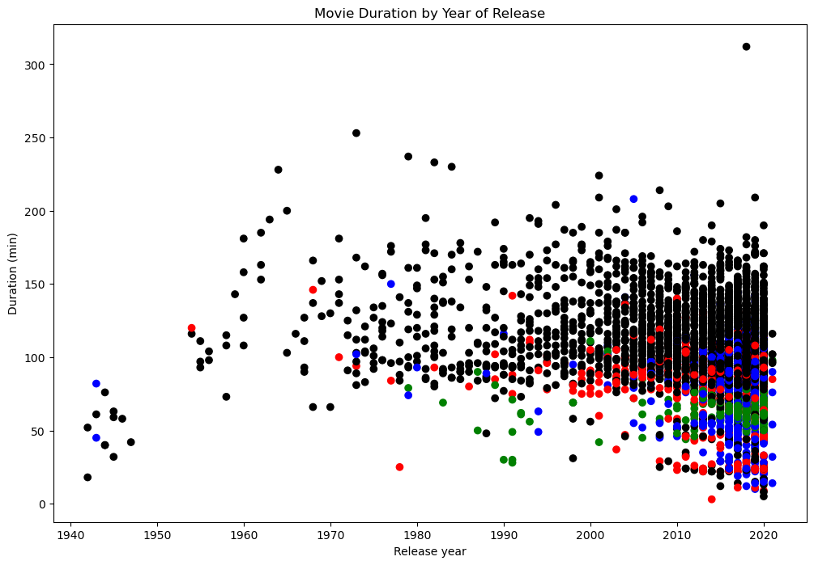

# Investigating-Netflix-Movies

## Description
A study showcasing data visualization and exploration methods to determine whether Netflix's movie duration times have gotten shorter. I was able to learn about the patterns and features of Netflix movie durations by utilizing Python and its modules for data processing and visualization.
## Datasource
The [data](https://github.com/croweigibson/Investigating-Netflix-Movies/blob/main/netflix_data.csv) used in this project as well as the complete [notebook](https://github.com/croweigibson/Investigating-Netflix-Movies/blob/main/Investigating%20Netflix%20Movies.ipynb)
## Objective
The main objective is to see if netflix movies have gotten shorter over time. 
## Loading the Data
I started by installing two Python libraries that'll help with the analysis: pandas and matplotlib. Then I created a dataframe using the CSV file. 
```sh
import pandas as pd
import matplotlib.pyplot as plt
netflix_df = pd.read_csv("netflix_data.csv")
print(netflix_df.head(5))
```
## Subsetting the DataFrame
I subsetted the `netflix_df` DataFrame to retain only the rows where the type is reported as 'Movie'.
```sh
subset_netflix = netflix_df[netflix_df['type'] == 'Movie']
print(subset_netflix.head(5))
```
## Creating a Second Subset
I further subsetted the `netflix_subset` DataFrame to retain only the columns 'title,' 'country,' 'genre,' 'release_year,' and 'duration.'I then saved the resulting DataFrame as 'netflix_movies'.
```sh
netflix_movies = subset_netflix[['title', 'country', 'genre', 'release_year', 'duration']]
print(netflix_movies.head())
```
## Filtering by movie length
I filtered the 'netflix_movies' DataFrame to include only movies with a duration of fewer than 60 minutes.
```sh
short_movies = netflix_movies[netflix_movies['duration'] < 60]
print(short_movies.head(5))
```
## Iterating Rows
I initialized an empty list called 'colours' to store different colour values. I iterated through the rows of the {netflix_movies} DataFrame using a for loop. I added the relevant colours to the list based on categories like "Children," "Documentaries," "Stand-Up," and others.
```sh
colors = []

# Iterate through netflix_movies rows
for label, row in netflix_movies.iterrows() :
    if row["genre"] == "Children" :
        colors.append("red")
    elif row["genre"] == "Documentaries" :
        colors.append("blue")
    elif row["genre"] == "Stand-Up":
        colors.append("green")
    else:
        colors.append("black")
```
## Visual Inspection
```sh
# Inspect the first 10 values in your list        
colors[:10]

# Set the figure style and initalize a new figure
fig = plt.figure(figsize=(12,8))

# Create a scatter plot of duration versus release_year
plt.scatter(netflix_movies.release_year, netflix_movies.duration, c=colors)

# Create a title and axis labels
plt.title("Movie Duration by Year of Release")
plt.xlabel("Release year")
plt.ylabel("Duration (min)")

# Show the plot
plt.show()
```
## Results and Conclusion
The result of our analysis of Netflix movie durations ended up being inconclusive. The duration of children's movies and documentaries does not appear to have changed much over the years.

## Future Considerations
- One of the most important steps will be to perform statistical analysis to measure trends and fluctuations in movie lengths. 
- Future analysis should include investigating the relationships between the lengths and genres of movies as it might also reveal interesting trends.
- Consider creating more elaborate visuals and interactive plots to improve the way findings are presented.
- Finally, using machine learning methods to forecast the lengths of movies based on different attributes can add insightful information to the study.
